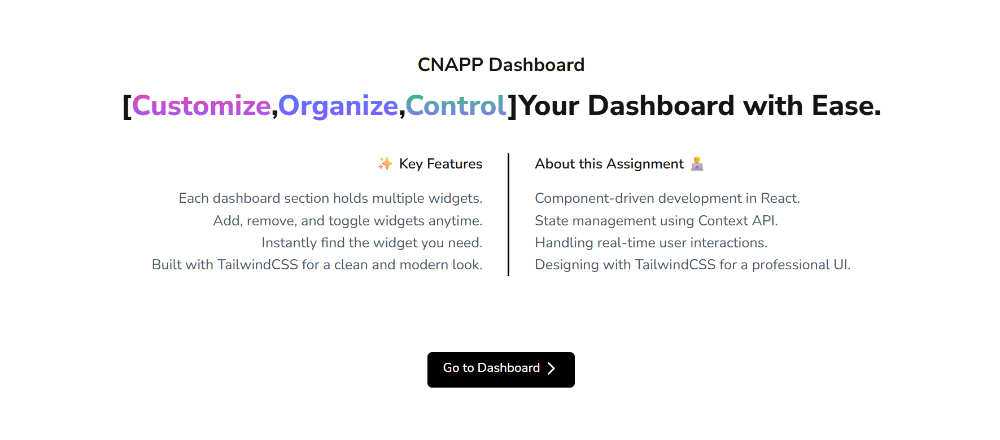

# CNAPP Dashboard

A dynamic and customizable dashboard built with **React, TypeScript, Vite, TailwindCSS, Context API, React Router, and MUI Icons**.  
This project was developed as part of a **Frontend Development Assignment**.

---

## 🚀 Features

- 📊 **Dynamic Categories:** Organize widgets into multiple categories.
- ➕ **Add Widgets:** Add widgets by providing name and description.
- ❌ **Remove Widgets:** Remove widgets easily with a single click.
- 🔍 **Search Widgets:** Quickly search for widgets across categories.
- ✅ **Check/Uncheck:** Toggle widget visibility with check/uncheck options.
- 🏠 **Multiple Pages:** Home Page and Dashboard Page using React Router.
- 🎨 **Modern UI:** Styled using TailwindCSS and enhanced with animations.
- 📱 **Responsive Design:** Fully responsive layout for all devices.
- 🏷️ **Semantic HTML:** Uses semantic HTML elements for accessibility and SEO.

---

## 🛠️ Tech Stack

- **React + TypeScript + Vite** (frontend framework)
- **React Router** (multi-page navigation)
- **TailwindCSS + tailwindcss-animate** (styling & animations)
- **MUI Icons** (icons)
- **Context API** (state management)

---

## 📂 Project Structure

src/
├── assets/ # Static assets (images, icons, etc.)
├── components/ # Reusable components
├── context/ # Context API setup for state management
├── data/ # Dummy JSON data for categories & widgets
├── hooks/ # Custom React hooks
├── pages/ # Pages (Home, Dashboard, etc.)
│ ├── Home.tsx
│ ├── Dashboard.tsx
├── App.tsx # Main App component with React Router
├── main.tsx # Application entry point

---

## ⚡ Getting Started

Follow these steps to run the project locally:

### 1. Clone the repository

```bash
git clone https://github.com/your-username/cnapp-dashboard.git
cd cnapp-dashboard
```

### 2. Install dependencies

```bash
npm install
```

### 3. Start development server

```bash
npm run dev

# The project will be running at:
http://localhost:5173
```

### 4. Build for production

```bash
npm run build
```

### 5. Preview production build

```bash
npm run preview
```

---

> “Good design is obvious. Great design is transparent.” — Joe Sparano
